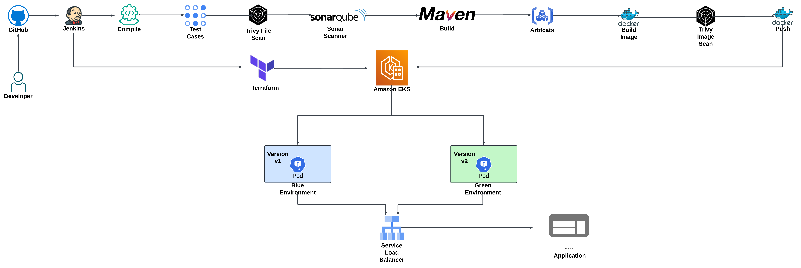

# Blue-Green Deployment Strategy for Dockerized Applications Using Jenkins and Kubernetes

 <!-- Replace with your project logo -->

## 📖 Overview

This project demonstrates a robust pipeline for deploying a Dockerized application using Jenkins in a Kubernetes environment. The pipeline employs a **blue-green deployment strategy**, ensuring minimal downtime and seamless updates. This setup enhances application availability and reliability, making it suitable for production environments.

## 🚀 Key Steps

### Set up EKS Cluster Using Terraform:
Terraform provisions an EKS cluster in AWS, automating the setup of nodes, networking, and security configurations. Version-controlled infrastructure enables easy scaling, modification, and consistent environments across different stages.

### Set up Jenkins, SonarQube, and Nexus:

Jenkins: Streamlines the build, test, and deployment pipeline, enhancing development efficiency and reducing time-to-market.
SonarQube: Provides in-depth code quality analysis and continuous inspection, ensuring adherence to coding standards and detecting vulnerabilities early.
Nexus: Acts as a centralized repository for storing build artifacts, including Docker images, promoting reuse and simplifying dependency management.

### Configure Kubernetes RBAC (Role-Based Access Control):
Roles and permissions are meticulously defined to enhance security, ensuring that only authorized users can access specific resources, thereby safeguarding the cluster against unauthorized actions.

### Create Jenkins Pipeline for Blue-Green Deployment:
Pipeline Steps:

- Build the application and create a Docker image: Ensures consistent builds and simplifies deployment.
- Check code quality with SonarQube: Validates the application’s integrity and reliability before deployment.
- Push the Docker image to Nexus: Facilitates easy access to the latest version for deployment.
- Deploy the new version to the Green environment: Allows for safe deployment in an isolated environment.
= Test the Green environment: Conducts thorough validation to confirm that the application operates as expected under real-world conditions.
- Switch traffic from Blue to Green using a load balancer: Ensures a smooth transition with minimal disruption to users.
- Provide an option to instantly roll back to Blue if needed: Enhances reliability and user experience by allowing rapid recovery from any deployment issues.

## 📦 Technologies Used

- **Terraform:** Manages infrastructure (EKS).
- **Jenkins:** Automates the CI/CD pipeline.
- **SonarQube:** Ensures code quality.
- **Nexus:** Manages build artifacts.
- **Kubernetes:** Hosts and manages the application.
- **AWS EKS:** Runs the Kubernetes cluster.
- **Trivy**: For vulnerability scanning of Docker images

## 🛠 How it Works

- **Deploy New Version to Green:** The new version is deployed to the green environment, isolated from live traffic, ensuring zero disruption.
- **Test on Green:* Comprehensive testing and validation are conducted in the green environment, allowing detection of potential issues without impacting users.
- **Switch Traffic to Green:** Upon successful testing, traffic is routed to green, enabling a seamless transition for users with minimal downtime.
- **Fallback to Blue:** If issues arise, traffic is instantly reverted to blue, allowing a rapid rollback that minimizes user impact and maintains service reliability.

## Key Benefits

- **Zero Downtime:** Users experience uninterrupted service as updates are applied seamlessly, maintaining a consistent user experience.
- **Risk Reduction:** Immediate rollback is possible if issues arise, allowing swift recovery and maintaining user trust.
- **Controlled Rollbacks:** Safe and easy rollbacks offer precise control, minimizing potential downtime and errors during recovery.
- **Real-World Testing:** New versions are tested in production-like conditions, ensuring reliability and performance under realistic loads before full release.
- **Flexibility:** Updates are deployed at an optimal pace, giving teams complete control over the process and reducing pressure to meet tight deadlines.
